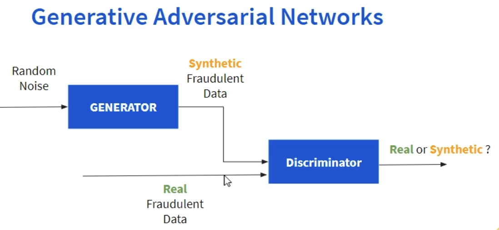

# Fraud Data Generation using GANs

## Overview
This project focuses on generating synthetic fraud data using Generative Adversarial Networks (GANs). The primary goal is to create realistic synthetic data that can be used for training and testing machine learning models for fraud detection

## Dataset : https://www.kaggle.com/datasets/sowmyakuruba/credit-card-fraud-detection/data

## Introduction
Fraud detection is a critical application of machine learning, especially in finance and banking. However, acquiring large datasets of fraudulent transactions is challenging due to privacy concerns and the rarity of fraud cases. This project leverages GANs to generate realistic synthetic fraud data, which can augment existing datasets and improve the performance of fraud detection models.

## Requirements
To run this project, you will need the following dependencies:

Python 3.7+
TensorFlow
Keras
NumPy
Pandas
Matplotlib
Scikit-learn

## Usage
To run the notebook and generate synthetic fraud data, follow these steps:

Start Jupyter Notebook:
Open the Fraud_Data_Generation_GAN.ipynb file in Jupyter Notebook.

Run the cells sequentially to train the GAN and generate synthetic data.

## Project Structure
Fraud_Data_Generation_GAN.ipynb: The main Jupyter Notebook containing the code for generating synthetic fraud data using GANs.
requirements.txt: List of required Python packages.

## Results
The notebook includes code to visualize the results of the GAN training process, including loss curves and examples of generated data. The generated synthetic data is saved in a CSV file for further analysis and use in machine learning models.

## Contributing
Contributions are welcome! If you have any improvements or suggestions, feel free to open an issue or submit a pull request.

## License
This project is licensed under the MIT License. See the LICENSE file for details.

